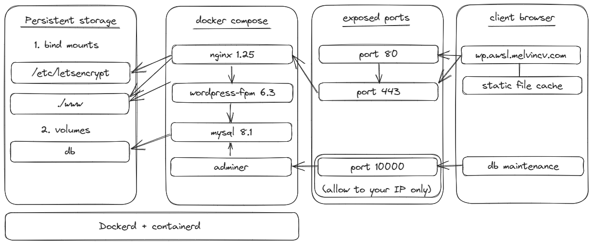

# 3 tier Wordpress with NGINX and Docker

:warning: The `env/dev.env` file is exposed intentionally. Ensure that you change the values in it before running docker compose.



## Objective

Run a 3 tier Wordpress site on a **single instance** using Docker Compose. Static file caching should be enabled on the client side. \
Use a container for each tier:

1. nginx
2. wordpress-fpm
3. mysql

Expose only ports 80 and 443. \
Also implement SSL using certbot and Let's Encrypt.

## Docker Compose

[Compose file](compose.yml)

Use the normal docker compose commands to bring up the stack. Due to Docker, this is a highly portable solution, though not scalable. \
If you need a scalable solution, use a container orchestrator like Kubernetes.

> Note that you need to edit the `env/dev.env` file and add your secret variables for docker compose to work properly. \

```
docker compose up -d --build
```

## NGINX Config

[Main Config file](nginx/nginx.conf) \
[Virtualhost for Wordpress](nginx/wp.conf)

Modifying the main config file is optional. I have enabled `gzip` compression here. \
The Virtualhost file contains the `server{}` block for the wordpress site. This contains all the virtualhost settings plus static file caching and SSL. \

## Wordpress Image Buiding

[Dockerfile and custom.ini](wp)

The above folder contains the Dockerfile and the custom.ini file containing custom PHP settings. \
This is used for building a custom wordpress-fpm image with the PHP settings that we want.

## Wordpress CLI

The WP CLI can be used to manage Wordpress even if the web interface is down. Modify the variables and run the script:

[Script](run-wpcli.sh)

## Let's Encrypt SSL

TODO

## Security Headers

TODO

